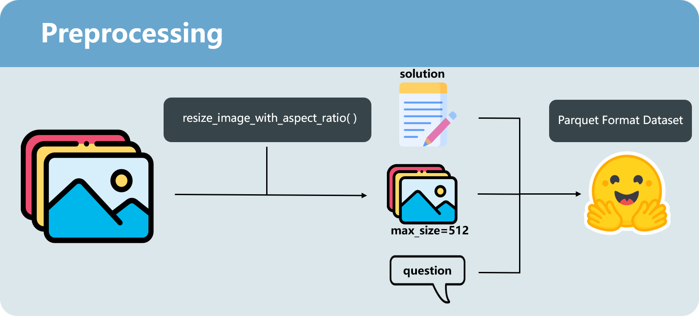
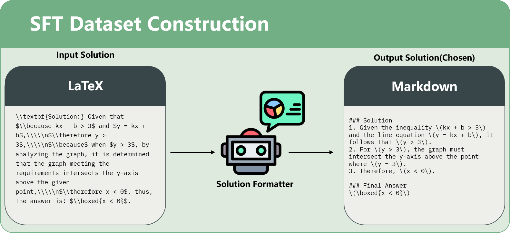

# 🧙‍♂️Math Wizard: SFT+DPO-Tuned gemma-3n


🤗 **Model Weights:** [gemma-3n-gek408-dpo](https://huggingface.co/Argobell/gemma-3n-gek408-dpo)  
🤗 **SFT Dataset:** [gek408](https://huggingface.co/datasets/Argobell/gek408)  
🤗 **DPO Dataset:** [gek408-dpo](https://huggingface.co/datasets/Argobell/gek408-dpo)

---

This repository contains a collection of scripts and resources for fine-tuning gemma-3n (using Unsloth). The process involves three main stages: **dataset processing**, **Supervised Fine-Tuning (SFT)**, and **Direct Preference Optimization (DPO)**.

## 📚 Table of Contents

- [🧙‍♂️Math Wizard: SFT+DPO-Tuned gemma-3n](#️math-wizard-sftdpo-tuned-gemma-3n)
  - [📚 Table of Contents](#-table-of-contents)
  - [⚙️ Installation](#️-installation)
  - [⚡ Core Framework: Unsloth](#-core-framework-unsloth)
  - [📊 Dataset Preparation](#-dataset-preparation)
  - [📈 SFT Supervised Fine-Tuning](#-sft-supervised-fine-tuning)
  - [🏆 DPO Direct Preference Optimization](#-dpo-direct-preference-optimization)
  - [🚀 Quick Start](#-quick-start)
  - [📂 File Structure](#-file-structure)
  - [🔗 Dependencies](#-dependencies)

## ⚙️ Installation

This project uses `uv` for package management. To create a virtual environment and install the dependencies, run the following commands:

```bash
# Create the virtual environment
uv venv --python=3.11

# Activate the environment
# On macOS/Linux:
source .venv/bin/activate
# On Windows:
.venv\Scripts\activate

# Install dependencies
uv sync
```

## ⚡ Core Framework: Unsloth

This project is powered by [Unsloth](https://github.com/unslothai/unsloth), a high-performance framework designed to significantly accelerate the fine-tuning of large language models.

**Key Advantages of Unsloth:**

*   **Faster Training:** Unsloth can make training up to 2x faster than standard Hugging Face methods.
*   **Memory Efficiency:** It reduces GPU memory usage by up to 70%, enabling you to fine-tune larger models or use bigger batch sizes on the same hardware.
*   **Ease of Use:** Unsloth seamlessly integrates with the Hugging Face ecosystem (like `transformers` and `peft`) and requires minimal code changes. It automates many optimizations, providing a smoother development experience.

By using Unsloth, we achieve faster iterations and more efficient use of computational resources.

## 📊 Dataset Preparation

Before training the model, the raw data needs to be preprocessed. The `src` directory contains the necessary scripts for this purpose.

The `@src/data_preprocess.py` script requires the `THU-KEG/MM_Math` dataset from Hugging Face. Please [download it here](https://huggingface.co/datasets/THU-KEG/MM_Math) and place it in the appropriate directory as instructed by the script.

To generate the SFT dataset, you must create a `.env` file in the project root and provide your `API_KEY` and `BASE_URL`.



Below are the scripts and their example startup commands.

- **`src/data_preprocess.py`**: Cleans and preprocesses the raw data.
  ```bash
  python src/data_preprocess.py --image_folder path/to/your/images --json_path path/to/your/data.jsonl --output_path processed_data
  ```

- **`src/generate_sft_data.py`**: Generates conversational-style data required for the SFT stage. This script requires API access.
  ```bash
  # Process the training split
  python src/generate_sft_data.py --spilt train --input_path processed_data --output_path sft_data
  
  # Process the validation split
  python src/generate_sft_data.py --spilt val --input_path processed_data --output_path sft_data
  ```

- **`src/dpo_generator.py`**: Creates preference pairs (chosen & rejected) for the DPO stage.
  ```bash
  python src/dpo_generator.py --model_path path/to/your/sft_model --dataset_path sft_data --output_dir dpo_data --split validation
  ```

## 📈 SFT Supervised Fine-Tuning

In the SFT stage, the model is initially fine-tuned on the prepared dataset.

**SFT Dataset Construction:**



**Start Training:**

Run the following script to start the SFT training:

```bash
bash train_sft.sh
```

This script will execute `src/sft_multi.py` with the required parameters.

**Training Results:**

The loss curve for the SFT stage is shown below:


## 🏆 DPO Direct Preference Optimization

The DPO stage further refines the SFT model using a preference dataset, aligning its outputs more closely with human preferences.

**DPO Dataset Construction:**


**Start Training:**

Run the following script to start the DPO training:

```bash
bash train_dpo.sh
```

This script will execute `src/dpo_multi.py` with the required parameters.

**Training Results:**

The metrics for the DPO stage are as follows:

| DPO Loss | Reward Accuracy |
| :---: | :---: |
|  |  |
| **Reward Chosen** | **Reward Rejected** |
|  |  |
| **Reward Margin** |
|  |

## 🚀 Quick Start

The `examples` folder provides Jupyter Notebooks to help you get started quickly.

- `sft.ipynb`: Example for SFT model inference.
- `dpo.ipynb`: Example for DPO model inference.
- `inferenc.ipynb`: A complete example of the model inference pipeline.

## 📂 File Structure

```
.
├── .gitignore
├── pyproject.toml
├── README.md
├── train_dpo.sh
├── train_sft.sh
├── uv.lock
├── examples/
│   ├── dpo.ipynb
│   ├── inferenc.ipynb
│   └── sft.ipynb
├── prompt/
│   └── ...
├── resources/
│   └── ...
└── src/
    ├── data_preprocess.py
    ├── dpo_generator.py
    ├── dpo_multi.py
    ├── generate_sft_data.py
    └── sft_multi.py
```

## 🔗 Dependencies

This project primarily relies on the following Python libraries:

- `torch`
- `transformers`
- `datasets`
- `peft`
- `trl`
- `bitsandbytes`
- `accelerate`
- `unsloth`
- `unsloth-zoo`

For a detailed list of dependencies, please refer to the `pyproject.toml` file.