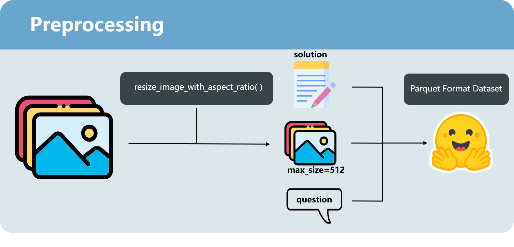
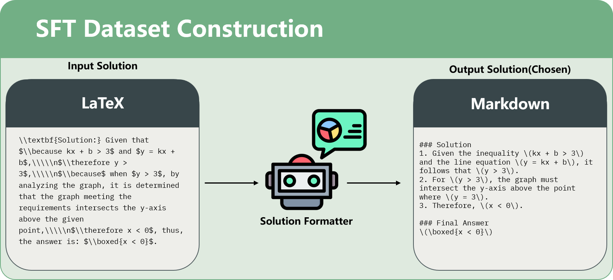
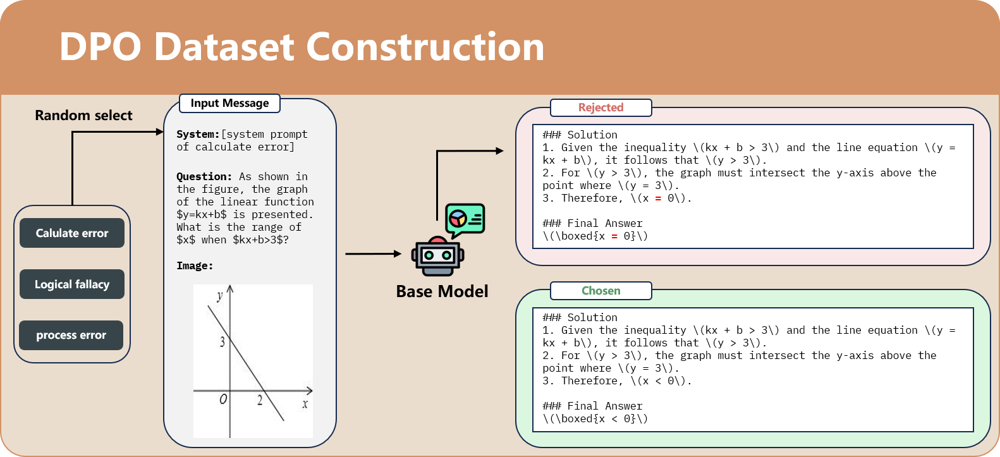

# 🧙‍♂️ Math Wizard: An Offline-Ready AI Tutor for Equitable Education

**Author**: Argobell
**Date**: August 4, 2025

---

## Abstract

Globally, countless students are excluded from the digital learning revolution due to poor or non-existent internet connectivity. This project directly addresses this "digital divide" by creating "Math Wizard," a lightweight and efficient AI math tutor built on Google's `gemma-3n` model. Our solution is engineered specifically for offline-first deployment, enabling it to run on standard consumer hardware without requiring a cloud connection.

We employ a sophisticated two-stage fine-tuning process:
1.  **Supervised Fine-Tuning (SFT)** to imbue the model with foundational mathematical knowledge and problem-solving structures.
2.  **Direct Preference Optimization (DPO)** to align the model's outputs with human preferences for clear, intuitive, and pedagogically sound explanations.

This report details the architecture, technical choices, and challenges overcome in creating a model that is not just accurate, but is also an effective and patient teacher, designed to democratize education.

---

## Project Assets

🤗 **Model Weights:** [gemma-3n-gek408-dpo](https://huggingface.co/Argobell/gemma-3n-gek408-dpo) &nbsp;&nbsp;•&nbsp;&nbsp; 🤗 **SFT Dataset:** [gek408](https://huggingface.co/datasets/Argobell/gek408) &nbsp;&nbsp;•&nbsp;&nbsp; 🤗 **DPO Dataset:** [gek408-dpo](https://huggingface.co/datasets/Argobell/gek408-dpo)

---

## 1. Vision & Architecture

### 1.1. Project Mission
Our mission is to **revolutionize education by creating interactive, offline-ready learning experiences for students in low-connectivity regions.** We envision a world where every student has a personal AI tutor, regardless of their location or internet access. This tutor must be:

*   **Offline-Ready**: Fully functional without an internet connection.
*   **Interactive**: Capable of engaging in a dialogue, not just providing answers.
*   **Efficient**: Lightweight enough to run on standard, non-specialized hardware.

We chose mathematics as our starting point, as it is the foundational language of science and technology.

### 1.2. Technical Architecture
Our architecture is a deliberate, multi-stage pipeline designed to build not just a problem-solver, but a teacher.


*<p align="center">Figure 1: The initial data preprocessing workflow.</p>*

1.  **Dataset Preparation**: We begin by cleaning and structuring the `THU-KEG/MM_Math` dataset. This stage (`src/data_preprocess.py`) is critical for creating a clean, standardized knowledge base for the model.

2.  **Supervised Fine-Tuning (SFT)**: In this phase, we teach the model the "textbook" knowledge. The `gemma-3n` model is fine-tuned on a structured dataset of math problems and their solutions, learning core concepts, formulas, and step-by-step reasoning.


*<p align="center">Figure 2: Constructing question-answer pairs for the SFT stage.</p>*

3.  **Direct Preference Optimization (DPO)**: This stage elevates the model from a calculator to a tutor. Using a preference dataset of "chosen" (better) and "rejected" (worse) answers, DPO teaches the model *how* to explain concepts. It learns to prefer clear, elegant, and pedagogically sound reasoning over answers that are merely correct but confusing.


*<p align="center">Figure 3: Creating preference pairs (chosen vs. rejected) for the DPO stage.</p>*

---

## 2. Technical Choices & Justification

Every technical decision was made to serve our core mission of creating an accessible, offline-first educational tool.

#### Why Gemma-3n?
The choice of `gemma-3n` was intentional and mission-critical.
*   **Engineered for Offline Use**: `gemma-3n` provides an exceptional balance of performance and size. It is small enough to be bundled within a desktop or mobile application, enabling true offline functionality. This is non-negotiable for our target users, who cannot rely on cloud-based APIs.
*   **Solid Foundation**: Google's Gemma models are pre-trained on high-quality data, providing a robust foundation that allows us to achieve excellent performance with domain-specific fine-tuning on a relatively small dataset.

#### Why an SFT + DPO Two-Stage Approach?
*   **SFT for Foundational Knowledge**: SFT is the most effective way to instill a structured knowledge base. It acts as the "textbook," ensuring the model masters the core mathematical curriculum correctly and reliably.
*   **DPO for Pedagogical Skill**: A great teacher does more than give correct answers; they guide and inspire. DPO acts as our "teaching coach." By learning from comparisons of good and bad explanations, the model develops an intuitive sense for pedagogy. This is crucial for maintaining student engagement and building their confidence.

#### Why Unsloth?
*   **Democratizing AI Development**: Unsloth is a key enabler for this project. By doubling training speed and reducing memory usage by up to 70%, it allowed us to conduct all development and experimentation on a single consumer-grade GPU. This drastically lowers the barrier to entry and proves that impactful AI engineering is possible without access to massive compute clusters.

---

## 3. Challenges & Solutions

Developing an AI for education presents unique challenges that go beyond simple model accuracy.

*   **Challenge 1: Defining and Sourcing "Good Teaching" for DPO**
    *   **Problem**: For DPO, a "rejected" sample is not just a wrong answer. It can be a correct answer with confusing steps, a logical leap, or an unhelpful explanation. Sourcing these nuanced pairs is difficult.
    *   **Solution**: We developed `src/dpo_generator.py`, a script that uses the SFT model to generate multiple answer candidates. It then programmatically identifies and flags common pedagogical flaws (e.g., calculation errors, logical fallacies) to create high-quality, nuanced "rejected" samples. This provided a much stronger learning signal for the DPO stage.

*   **Challenge 2: Ensuring Model Reliability and Safety**
    *   **Problem**: An educational tool must be trustworthy. It cannot afford to provide plausible-sounding but incorrect information that could mislead a student.
    *   **Solution**: Our rigorous data pipeline (`src/data_preprocess.py`) includes normalization and cleaning steps to eliminate ambiguity and factual errors from the source data. Furthermore, the DPO training inherently strengthens the model's ability to recognize and avoid subtly flawed reasoning, making it a safer and more reliable tutor.

---

## 4. Training & Results

Our training metrics validate the effectiveness of our two-stage approach. The model first shows a steady acquisition of knowledge during SFT, followed by a clear alignment with human preferences during DPO.

### 4.1. SFT Stage
The consistent decrease in training loss indicates that the model effectively learned the mathematical concepts and problem-solving patterns from the SFT dataset.


*<p align="center">Figure 4: SFT training loss.</p>*

### 4.2. DPO Stage
The DPO metrics demonstrate the model's success in learning to differentiate between high- and low-quality answers. The reward margin, accuracy, and loss all point to a successful preference alignment.

| DPO Loss | Reward Accuracy |
| :---: | :---: |
|  |  |
| **Reward Margin** | **Reward Chosen** |
|  |  |

*<p align="center">Table 1: DPO training metrics.</p>*

---

## 5. How to Replicate

This project uses `uv` for package management.

### 5.1. Installation
```bash
# Create the virtual environment
uv venv --python=3.11

# Activate the environment
# On macOS/Linux:
source .venv/bin/activate
# On Windows:
.venv\Scripts\activate

# Install dependencies
uv sync
```

### 5.2. Dataset Preparation
The `src/data_preprocess.py` script requires the `THU-KEG/MM_Math` dataset. Please [download it here](https://huggingface.co/datasets/THU-KEG/MM_Math) and place it in the appropriate directory. To generate the SFT dataset, create a `.env` file in the project root and provide your `API_KEY` and `BASE_URL`.

```bash
# 1. Preprocess the raw data
python src/data_preprocess.py --image_folder path/to/your/images --json_path path/to/your/data.jsonl --output_path processed_data

# 2. Generate SFT data
python src/generate_sft_data.py --spilt train --input_path processed_data --output_path sft_data

# 3. Generate DPO data
python src/dpo_generator.py --model_path path/to/your/sft_model --dataset_path sft_data --output_dir dpo_data --split validation
```

### 5.3. Training
Execute the provided shell scripts to run the training pipelines.

```bash
# Run SFT training
bash train_sft.sh

# Run DPO training
bash train_dpo.sh
```

### 5.4. Inference
Jupyter notebooks with inference examples are available in the `examples/` directory.

---

## 6. File Structure & Dependencies

### 6.1. File Structure
```
.
├── .gitignore
├── pyproject.toml
├── README.md
├── report.md
├── train_dpo.sh
├── train_sft.sh
├── uv.lock
├── examples/
│   ├── dpo.ipynb
│   ├── inferenc.ipynb
│   └── sft.ipynb
├── prompt/
│   └── ...
├── resources/
│   └── ...
└── src/
    ├── data_preprocess.py
    ├── dpo_generator.py
    ├── dpo_multi.py
    ├── generate_sft_data.py
    └── sft_multi.py
```

### 6.2. Core Dependencies
This project relies on the following key libraries:
- `torch`
- `transformers`
- `datasets`
- `trl`
- `bitsandbytes`
- `accelerate`
- `unsloth`
- `timm`


For a complete list, please see the `pyproject.toml` file.
